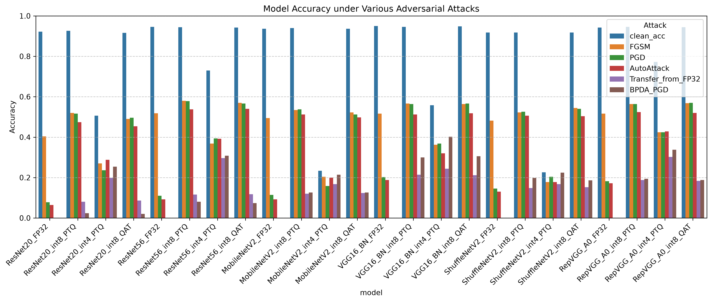
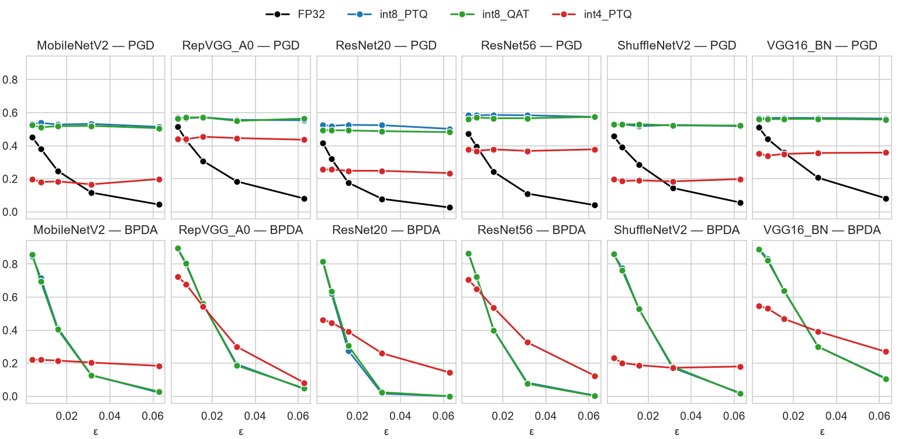
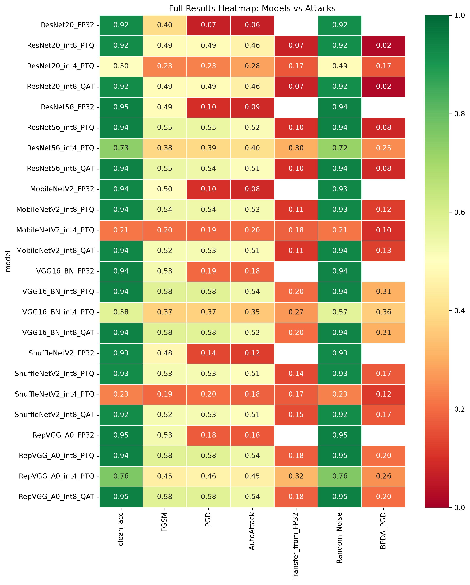

# QuantAdv
Quantized models introduce discrete rounding operations into the computational graph, which may produce either genuine robustness against *inference-time evasion attacks* (coarser weight representation changing the decision boundary geometry) or gradient masking (rounding causing zero gradients that blind attacks). The current configuration evaluates pretrained TorchCV ResNet56, WRN-28-10, and DenseNet-100 models on CIFAR-100 across FP32, PTQ, and QAT variants using a layered attack suite. Dataset construction, preprocessing, class count, and TorchCV model identifiers are selected centrally in `src/config.py`.

## Setup

To install (most) dependencies  
`pip install -r requirements.txt`

To download datasets (should be placed at root)  
*CIFAR-10*
```
wget https://www.cs.toronto.edu/~kriz/cifar-10-python.tar.gz
curl -O https://www.cs.toronto.edu/~kriz/cifar-10-python.tar.gz
```

*CIFAR-100*
```
wget https://www.cs.toronto.edu/~kriz/cifar-100-python.tar.gz
curl -O https://www.cs.toronto.edu/~kriz/cifar-100-python.tar.gz
```

or set Download=true

To run  
`python src/QuantAdv.py`  

To graph incomplete results
`python -m src.graphs.combine`

To generate the consolidated formal figures
`python -m src.graphs.formaldata`

Obsolete run    
`python src_old/launcher.py`

> **Notice:** You may need to adjust pathing or move the scripts to root for obsolete files.

Results are in ./data






<!-- <p align="center">
  
  
</p> -->
